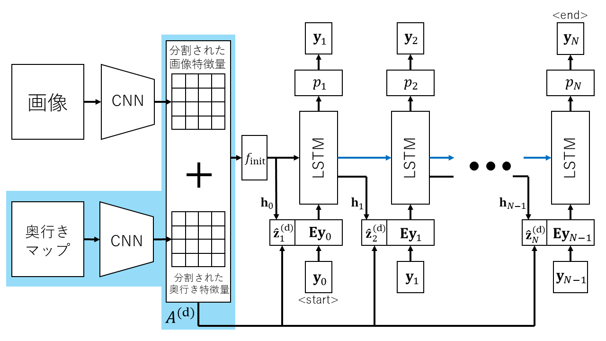
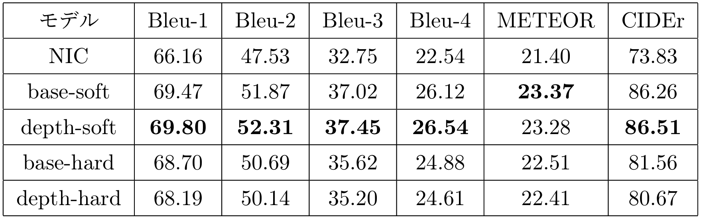

# 画像キャプショニングにおける注意機構と奥行き情報の活用
## このリポジトリは上記テーマの研究で使用したコードをまとめたものです。

## 1. 研究概要
画像から自然言語による説明文（キャプション）を自動生成する「画像キャプショニング」において、モデルの性能向上を目的とし、注意機構と奥行き情報を統合的に活用する新たなモデルを提案・検証した。

従来の画像キャプショニングでは、CNNによる画像特徴抽出と、RNN（特にLSTM）によるキャプション生成を組み合わせたエンコーダ-デコーダ型の構造が主流であり、さらに注意機構（アテンション）を導入することで、画像中の重要部分に焦点を当てながら文を生成する「[Show, Attend and Tell](https://arxiv.org/abs/1502.03044)」モデルが提案されてきた。しかし、これらのモデルには、物体の前後関係や奥行きといった三次元的な空間構造を十分に捉えているとは限らないという課題がある。

そこで本研究では、RGB画像と奥行きマップ（Depth Map）の両方を入力とし、それぞれに別個のCNNを適用してアノテーションベクトル（画像を格子状に分割した領域ごとの特徴量）を抽出し、それらを統合することで、奥行き情報を含んだ注意機構付き画像キャプショニングモデルを提案した(図1)。アノテーションベクトルは、各単語を予測するステップにおいてRNNの隠れ状態と関連度を計算し、関連性の高い画像領域の特徴量を選択するために利用される。本手法では、RGB画像と奥行きマップのそれぞれから得られた対応するアノテーションベクトルを加算することで、空間的な情報を反映したベクトルを生成し、それを注意機構で活用する。これにより、モデルが物体の配置や前後関係といった三次元的構造を考慮したキャプションを生成できるようになることを目指した。

評価実験は大きく2つ実施した。第一の実験では、提案モデル（ソフトアテンション型およびハードアテンション型）と既存モデルを比較し、MSCOCO2014データセットにおいて奥行き情報の有効性を検証した。その結果、ソフトアテンションモデルに奥行き情報を加えた提案モデルは、BleuやCIDErといった主要な評価指標で既存モデルを上回るスコアを記録し、性能向上が確認された。一方で、ハードアテンションモデルではスコアが低下し、これはアノテーションベクトルの情報量増加により、学習が不安定になったことが一因と考察された。

第二の実験では、物体の前後関係を明示的に記述したオリジナルの合成画像データセットを作成し、提案モデルが奥行きと単語との関係性を学習できるかを検証した。その結果、ソフトアテンション型の提案モデルは、従来モデルを大きく上回るスコアを記録し、モデルが奥行き情報を適切に活用できていることが明確となった。このことから、奥行き情報がキャプション生成において有効な手がかりとなる可能性が示唆された。

以上の結果より、奥行き情報はソフトアテンションとの相性が良く、物体の配置や背景の理解を深めることで、より精緻で自然なキャプション生成を可能にすることが明らかとなった。一方で、ハードアテンションモデルとの統合や、物体検出ベースの手法への拡張、さらには音声やセンサ情報などの異なるモダリティとの統合も、今後の課題として残されている。
<figure style="text-align: center;">
  
  <figcaption>図1: モデル図</figcaption>
</figure>

## 実験結果
MSCOCO2014での実験結果(150 epoch)<br>[base-soft, base-hard]は既存モデル(Show, Attend and Tell)、[depth-soft, depth-hard]は提案モデル。ソフトアテンションの提案モデルdepth-softのスコアがMETEORを除いてbase-softより高くなったことがわかる。
<figure style="text-align: center;">
  
  <figcaption>表1: MSCOCO2014 Validationセット4000点に対するスコア</figcaption>
</figure>

## 使用方法
### 準備(環境構築)
```bash
# 仮想環境の作成と有効化
conda create -n depth_cap python=3.8
conda activate depth_cap

# ここで、torch.org(https://pytorch.org/get-started/previous-versions/)を参考にCUDA対応のPyTorch(v1.9.0)をインストール

# その他の依存ライブラリをpipでインストール
pip install -r requirements.txt
```
### MSCOCO2014のダウンロード
[MSCOCO2014データセットダウンロードページ](https://cocodataset.org/#download)の「2014 Train images[83k/13GB]」と「2014 Val images[41k/6GB]」、「2014 Train/Val annotations [241MB]」をダウンロード。<br>それぞれのzipファイルを./dataset/coco2014に解凍。
# あ
